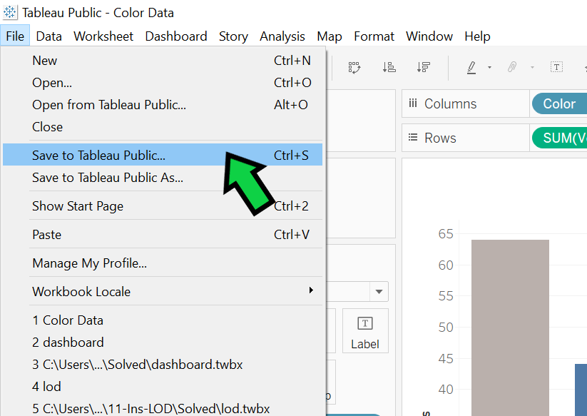
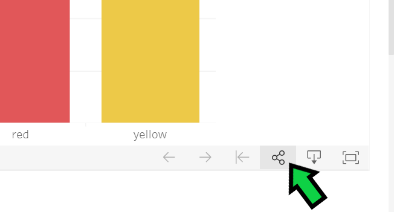
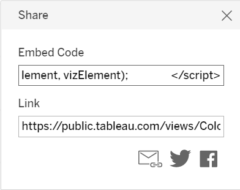

# Tableau Embedded Webpage

I created a simple webpage with a link to a [Tableau visualization](https://public.tableau.com/views/ColorData/VotesforFavoriteColor?:language=en&:display_count=y&publish=yes&:origin=viz_share_link) that I created and shared using Tableau Public.  The website was then hosted on [GitHub Pages](https://nshown.github.io/tableau-embedded-webpage/).

To create my visualization I loaded the [temp-color.json](/data/temp-color.json) data into Tableau and generated a bar chart.

To add a Tableau visualization to a webpage you can complete the following steps: 

* First save your work to Tableau Public:

    
 
* If you haven't created your Tableau Public account you can choose to do so after clicking "Save to Tableau Public."

* After saving to Tableau Public your web browser will open to your visualizations page on Tableau Public, it will look like [this](https://public.tableau.com/views/ColorData/VotesforFavoriteColor?:language=en&:display_count=y&publish=yes&:origin=viz_share_link).  If your web browser does not open to your published visualization you can find it by logging into your Tableau Public account, viewing your profile, and selecting the visualization that you wish to share.

* Once you have browsed to your visualization select the "Share" icon in the bottom right corner of your visualization.
  
    

* This will cause a Share dialog window to be displayed.

    

* If you would like to distribute a link to your visualization copy the "Link" text.  To add the visualization to a webpage copy the "Embed Code."
  
* Paste the "Embed Code" HTML into your webpage.